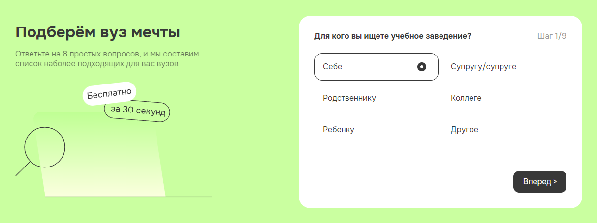

# quiz

## Описание проекта
Quiz – это вопросник, с адаптивностью и интерактивностью.

## Ключевые навыки:
- валидная семантическая адаптивная вёрстка
- легкоподдерживаемый читаемый код
- возможность масштабирования

## Особенности:
- Имеется мобильная и ПК версии
- В шагах квиза есть текст “Шаг 1/..”. Этот текст генеруется автоматически при загрузке страницы. Экранов в квизе может быть сколько угодно
- Вопросы с вариантами ответов можно лекго редактировать в специальном файле
- Кнопка “Далее ” изначально, пока ничего не выбрано, не активна
- При выборе radio, кнопка “Далее” становится активной и происходит автоматический переход  на следующий шаг 
- При выборе значения в select, кнопка “Далее” становится активной
- При нажатии на кнопку “Назад” происходит смена шага на предыдущий где был выбран прошлый вариант
- При нажатии на кнопку “Далее” происходит переход на следующий шаг(актуально если в шаге только выбор в селекте или был переход на прошлый шаг)
- На шаге где нужно заполнить данные сделана заглушка отправляющие все необходимые данные в консоль и после ее выполнения появляется окно с сообщением

<kbd></kbd>

[Деплой проекта](https://zixail28.github.io/quiz/dist/)
